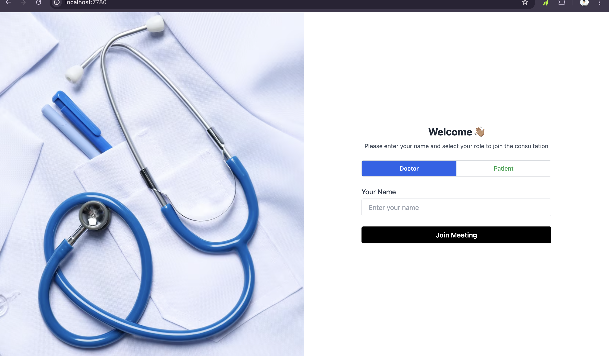
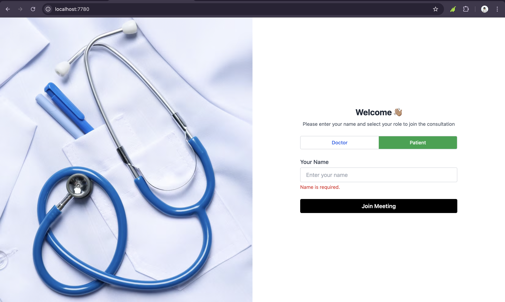

# 👩🏽‍⚕️ Secure Video Consultation Interface (Angular)

A responsive web interface for secure doctor-patient video consultations, built with **Angular + Tailwind CSS** and integrated with **Jitsi Meet** for real-time video communication.

---

## 🎯 Project Objective

To simulate a remote medical consultation platform where a **Doctor** and a **Patient** can securely log in, view each other over video, and manage their session in real time.

---

## 🧪 Features

- 🔐 Role-based mock login (Doctor / Patient)
- 📹 Live video chat powered by Jitsi Meet IFrame API
- 🧑🏽‍⚕️ Real-time user info panel (Name, Role, Status, Timer)
- 🎛️ Session controls:
  - Mute / Unmute
  - Start / Stop Video
  - End session with confirmation modal
- 🧘🏽 Clean responsive UI with Tailwind CSS
- ⚡ Lazy loaded routes & standalone Angular architecture

---

## 📸 Screenshots






<!-- Include screenshots of login screen + video screen with sidebar -->

---

## 🛠️ Tech Stack

| Tool/Tech         | Purpose                           |
|------------------|-----------------------------------|
| Angular 17       | Frontend Framework (Standalone)   |
| Tailwind CSS     | UI Styling                        |
| Jitsi Meet API   | Video Communication               |
| Angular Signals  | Local reactive state              |
| Lazy Loading     | Optimized module loading          |

---

## 🚀 Setup Instructions

```bash
# Clone the repo
git clone https://github.com/daniblueboy/secure-video-consultation.git
cd secure-video-consultation

# Install dependencies
npm install

# Run the app
ng serve
